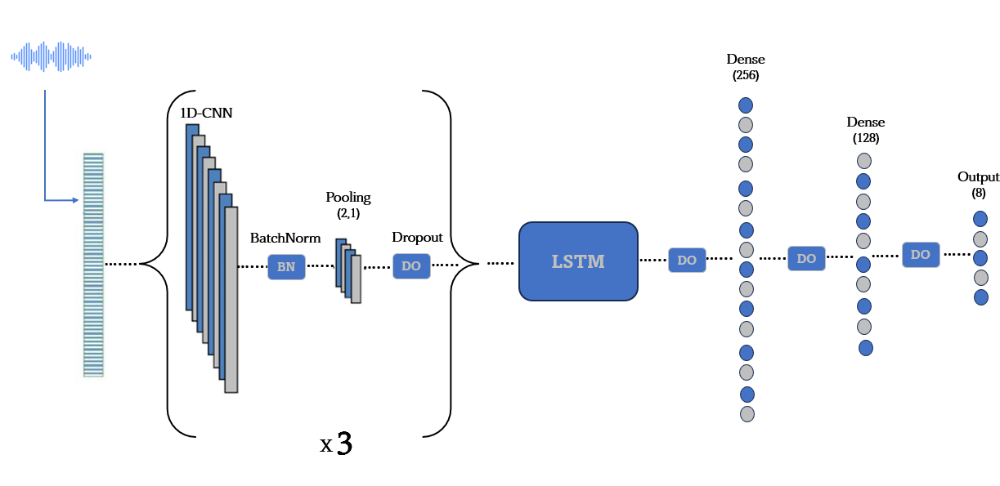
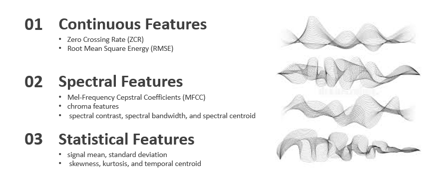

# Speech-Recognition

# Enhancing Speech Emotion Recognition with Multi-Feature Fusion via Convolutional Neural Networks
### Hmad ZENNOU, Youssef Taki, Mohamed OUHDA, and Mohamed BASLAM

### CNN_LSTM
<div align='center'>
</img>
</div>
<br />
We developed a new model called CNN-LSTM. This model combines convolutional memory and long-term memory (LSTM) layers to capture various temporal
and spatial features, thus enhancing the overall performance of SER systems.
By leveraging continuous and spectral features combined with a CNN-LSTM
architecture,  Our results show an improvement over the state of the art by 9% on the accuracy metric.


#### Model
<br />
CNN-LSTM model consists of 3 main steps: <br />
1- The robust and efficient feature extraction phase of our model and the best selection of features used. <br />
<div align='center'>
</img>
</div>
<br />
2- Data augmentation techniques to address limitations of the Ravdess dataset.<br />
3- Combine CNN and LSTM layers to capture different periods and spatial features, to enhance the overall performance of SER systems. <br />


### Setup: 
The code was written using Python 3.9. 
The following libraries are the minimal to run the code: 
```python
import Tensorflow
import Pandas
import numpy
import tqdm
```
To train our model for the Ravdes dataset  with the best configuration as in the paper, simply run:
```main
./main.py  
```
To see  our step-by-step implementation see:
```CNN-LSTM
./CNN-LSTM.ipynb  
```
